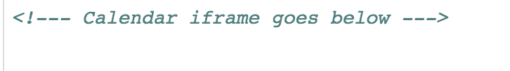
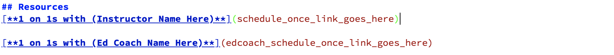
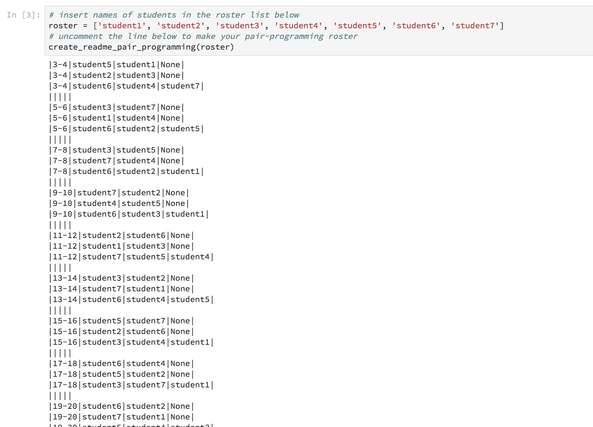
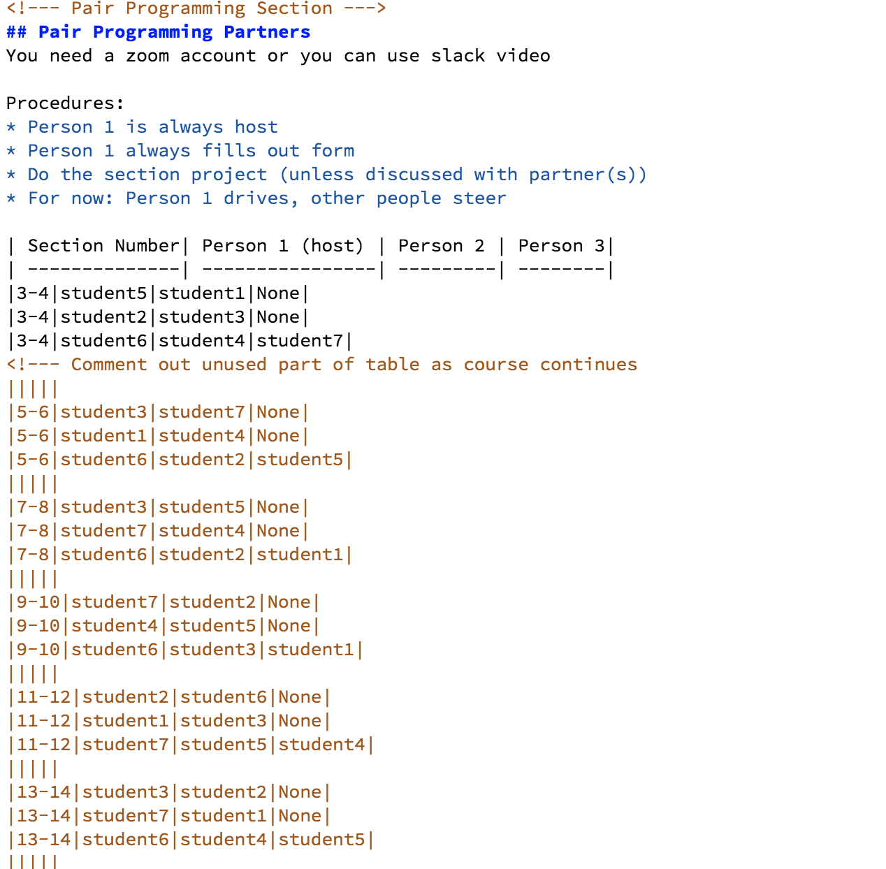
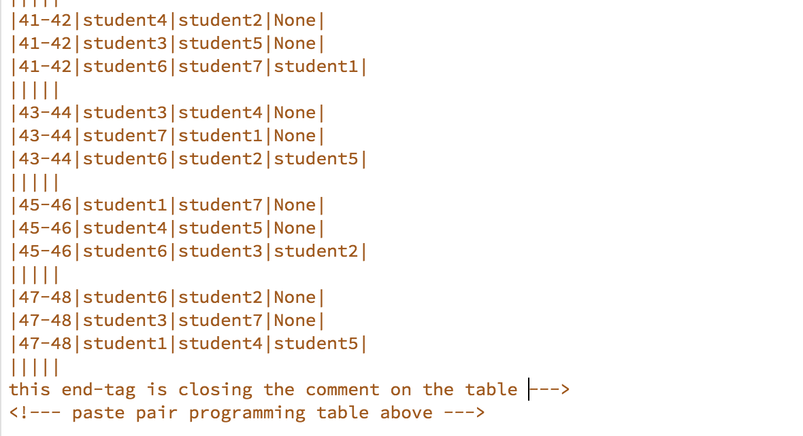

# Welcome to Flatiron School!

### To complete your README.md for your class you will need:
* Your 1 on 1 link made by ScheduleOnce
* Ed Coach 1 on 1 link 
* Your Class Google Calendar ```<iframe>``` code
* Orientation Recording Video Link (not needed immediately)
* Assessment Calendar Link (not needed immediately)


### Instructions for README.md (excluding Pair Programming Section)
* Open **README.md** and do the following
    * At the top insert your ```<iframe>``` code
    
    <kbd></kbd>

    * Scroll to the bottom under **```#Resources```**
        * Insert your link and ed coach link for 1 on 1s in the parentheses
        
        <kdb></kdb>
        
        * Insert the link to your Orientation Recording video into the parentheses
        
        <kdb></kdb>
        
        * Insert the link to your Project Assessment calendar into the parentheses
        
        <kdb></kdb>


### Instructions to Make Pair Programming Table
* Open **setup.ipynb** and 
    * insert your roster into the ```roster=[]``` list
    * Uncomment the line of code beneath it and run it to make your pair programming table
    <kdb></kdb>
* Open README.md
    * paste the readme string from ```setup.ipynb``` into the **Pair Programming Section Where Specified**
    * Comment out all weeks after 3-4
    * Comments in markdowns are made with

    ``` <!--- this is a comment
    it can be multiline as well
    so you can paste the entire table then

    --->```
    * The top of your table should look like this

    <kdb></kdb>

    * The bottom of your table should look like this

    <kdb></kdb>
    

### That's it! Just keep this updated as your class moves through the course!!!!
### Don't forget to make this your own and add things your class will benefit from! :)